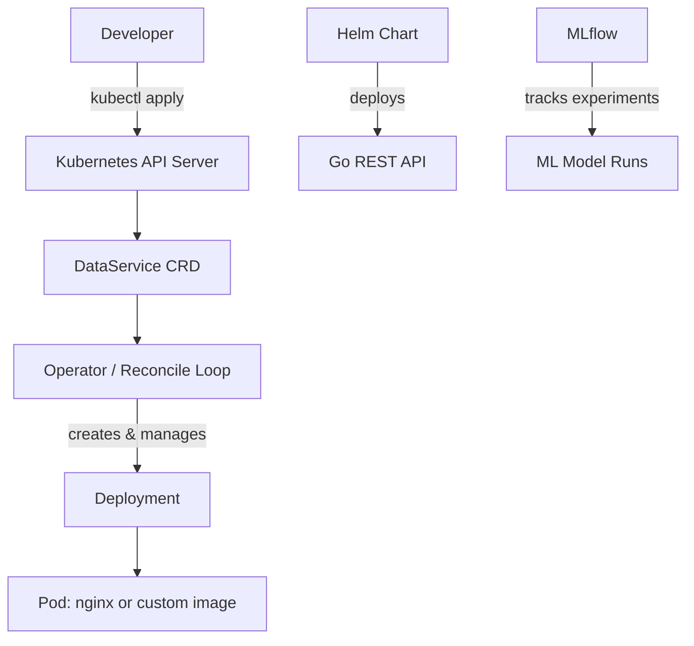

# k8s-operator-lab


A hands-on Kubernetes learning project built to demonstrate production-relevant skills for cloud platform engineering roles. The project covers the full stack: cluster setup, REST APIs, Helm charts, a custom Kubernetes Operator, and an MLOps mini-stack with MLflow.

---

## Architecture


---

## Project Structure
```
k8s-operator-lab/
├── api/v1/                  # CRD type definitions (DataService)
├── internal/controller/     # Reconcile loop logic
├── cmd/                     # Operator entrypoint
├── app/                     # Go REST API (/health, /hello)
├── charts/api/              # Helm chart for the REST API
├── config/                  # Kustomize manifests (RBAC, CRD, manager)
├── manifests/               # Phase 1 nginx manifests
└── .github/workflows/       # CI/CD pipeline
```

---

## Phases

**Phase 1 — Cluster & Core Concepts**
kind cluster, kubectl, k9s, Deployments, Services, ConfigMaps, Secrets, self-healing.

**Phase 2 — Go REST API + Helm**
REST API with `/health` and `/hello` endpoints, multi-stage Dockerfile, deployed via Helm into kind.

**Phase 3 — Kubernetes Operator**
Custom CRD `DataService` with kubebuilder. Reconcile loop implements Observe → Diff → Act. Owner references and self-healing validated in-cluster.

**Phase 4 — MLOps Mini-Stack**
MLflow deployed into a dedicated `mlops` namespace. Experiment tracking with logged metrics, parameters, and run verification via the MLflow UI.

**Phase 5 — CI/CD Pipeline**
GitHub Actions workflow: go test → build binary → docker build → push to ghcr.io. Image tagged with git SHA for deterministic builds.

---

## Local Setup

**Prerequisites:** Docker Desktop, kind, kubectl, Helm, Go 1.21+
```bash
# Create cluster
kind create cluster --name k8s-lab

# Deploy operator
make deploy IMG=ghcr.io/marius0711/k8s-operator-lab/operator:latest

# Apply a DataService
kubectl apply -f config/samples/app_v1_dataservice.yaml

# Check operator logs
kubectl logs -n k8s-operator-lab-system deploy/k8s-operator-lab-controller-manager
```

---

## What I Learned

Building a Kubernetes Operator from scratch required understanding the full control loop model: how the API server stores desired state, how informers watch for changes, and how a reconciler converges actual state toward desired state. The gap between `Update()` and `Patch()` — and why naive updates cause `object has been modified` errors under concurrent reconciliation — made the idempotency requirement concrete rather than theoretical.

The CI/CD pipeline enforces the same discipline a platform team would expect: no manual image builds, no ambiguous `latest` tags in production, tests must pass before anything is pushed.

---

## License

Apache 2.0
